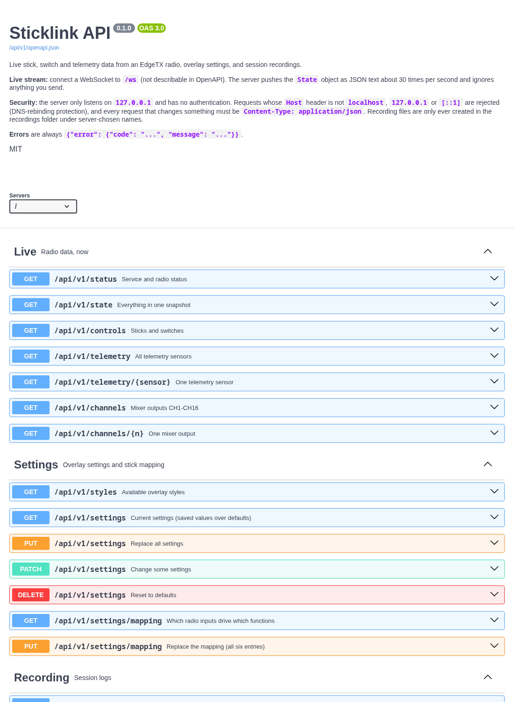

# REST API

Interactive documentation (Swagger UI, offline): <http://127.0.0.1:8765/docs>. The machine-readable OpenAPI 3.0 description
is at `/api/v1/openapi.json`. A test checks that every route is in that description and that real responses match its schemas.



## Endpoints

| Area | Method and path | What it does |
|---|---|---|
| Live | `GET /api/v1/status` | Service version, uptime, radio status, diagnostics, WebSocket clients, recording |
| | `GET /api/v1/state` | The full snapshot (also broadcast on the WebSocket) |
| | `GET /api/v1/controls` | Sticks normalised to -1..1, raw inputs, switch states |
| | `GET /api/v1/telemetry`, `/telemetry/{sensor}` | All sensors, or one by name (`RQly`, `RxBt`, ...) |
| | `GET /api/v1/channels`, `/channels/{n}` | Mixer outputs CH1-CH16, or one (1-16) |
| | `GET /api/v1/gps` | Position, home, distance and bearing from home, fix state |
| | `GET`, `DELETE /api/v1/gps/track` | The flown track (thinned to one point per 2 m, at most 5000); forget track and home |
| Settings | `GET /api/v1/styles` | The overlay styles |
| | `GET`, `PUT`, `PATCH`, `DELETE /api/v1/settings` | Read; replace everything; change some; reset to defaults |
| | `GET`, `PUT /api/v1/settings/mapping` | Which inputs drive roll, pitch, yaw, throttle, ARM, Crash Flip |
| Recording | `GET`, `POST`, `DELETE /api/v1/recording` | Current recording; start (optional `label`); stop |
| | `GET /api/v1/recordings` | Recordings in the folder, newest first |
| | `GET`, `DELETE /api/v1/recordings/{name}` | Download the raw JSONL; delete |
| | `GET /api/v1/recordings/{name}/report` | Quality report, like `check-log` |
| OBS scenes | `GET /api/v1/obs`, `PATCH /api/v1/obs/connection`, `POST /api/v1/obs/scene` | Connection to OBS, its scenes; change the connection; switch a scene now |
| | `GET`, `PUT /api/v1/scene-modes`, `GET /api/v1/scene-modes/state`, `POST /api/v1/scene-modes/apply` | The ranges per scene; live state; sync OBS to the switches now (see [scene switching](scenes.md)) |
| Stream | WebSocket `/ws` | The state object as JSON text, about 30 times a second (receive-only) |

`/api/state` and `/api/fx-config` from earlier versions still work and are marked deprecated.

## Examples

```bash
curl localhost:8765/api/v1/controls
curl localhost:8765/api/v1/channels/8
curl localhost:8765/api/v1/gps
curl -X PATCH localhost:8765/api/v1/settings -H 'content-type: application/json' -d '{"hud":{"layout":"row","cells":6,"map":{"provider":"none"}}}'
curl -X PATCH localhost:8765/api/v1/settings -H 'content-type: application/json' -d '{"style":"hacker","mode":2}'
curl -X POST   localhost:8765/api/v1/recording -H 'content-type: application/json' -d '{"label":"first-flight"}'
curl -X DELETE localhost:8765/api/v1/recording
curl localhost:8765/api/v1/recordings/20261006-143000-first-flight.jsonl/report
```

```python
import json, websockets, asyncio          # pip install websockets
async def main():
    async with websockets.connect("ws://127.0.0.1:8765/ws") as ws:
        async for message in ws:
            state = json.loads(message)
            print(state["status"], state["controls"])
asyncio.run(main())
```

Settings include a `hud` object (style, layout, blocks, battery cells, units and the map provider); a partial `hud` or `mapping` in a PATCH only changes what it names.

Values: `controls` are null unless the data is live (a reading within the last 500 ms); `channels` is null until the radio
script reports them; `status` is `live`, `demo`, `paused` or `disconnected`.

## Errors

Always JSON: `{"error": {"code": "invalid_settings", "message": "..."}}`, with the usual statuses: 400 invalid input, 403 foreign
Host header, 404 not found, 405 wrong method, 409 conflict (e.g. already recording), 413 body over 64 KB, 415 not JSON.

## Security model

There is no authentication, because the server only listens on `127.0.0.1`. Because a web page you visit could still
try to reach a local server, it also:

- rejects any request whose `Host` header is not `localhost`, `127.0.0.1` or `[::1]` (blocks DNS rebinding);
- requires `Content-Type: application/json` for everything that changes something, **including POSTs with an empty body** (a cross-site form
  cannot send that without a pre-flight request that the server does not answer, so a web page cannot start a recording or switch your OBS scene);
- creates recordings only in its recordings folder, with names it generates (`YYYYMMDD-HHMMSS[-label].jsonl`); clients can
  not choose paths, and file names in URLs are matched against a strict pattern;
- limits request bodies to 64 KB.

Do not expose the port to a network (for example by forwarding it) without putting authentication in front of it.
