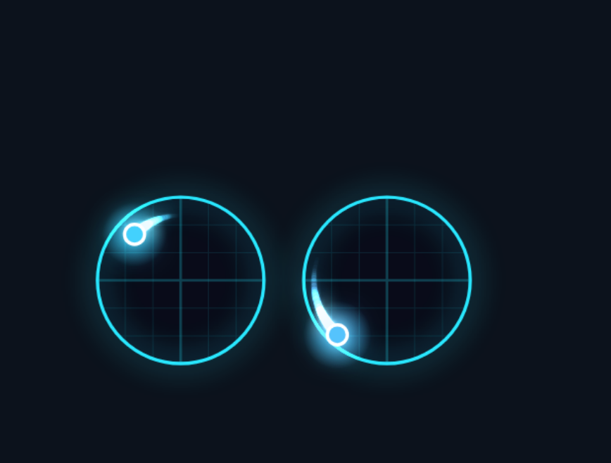
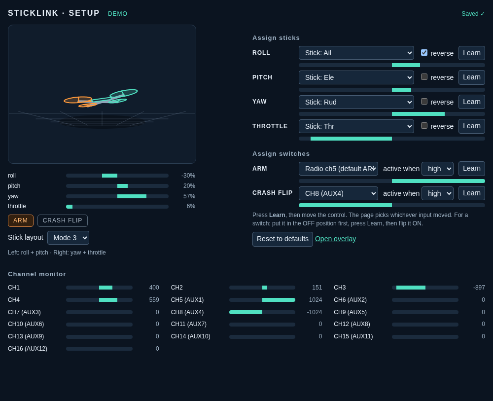
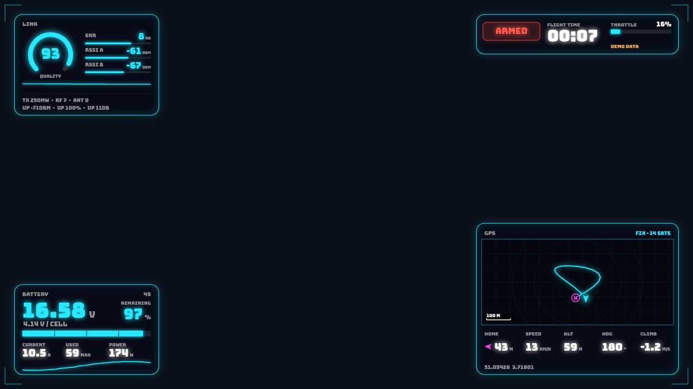
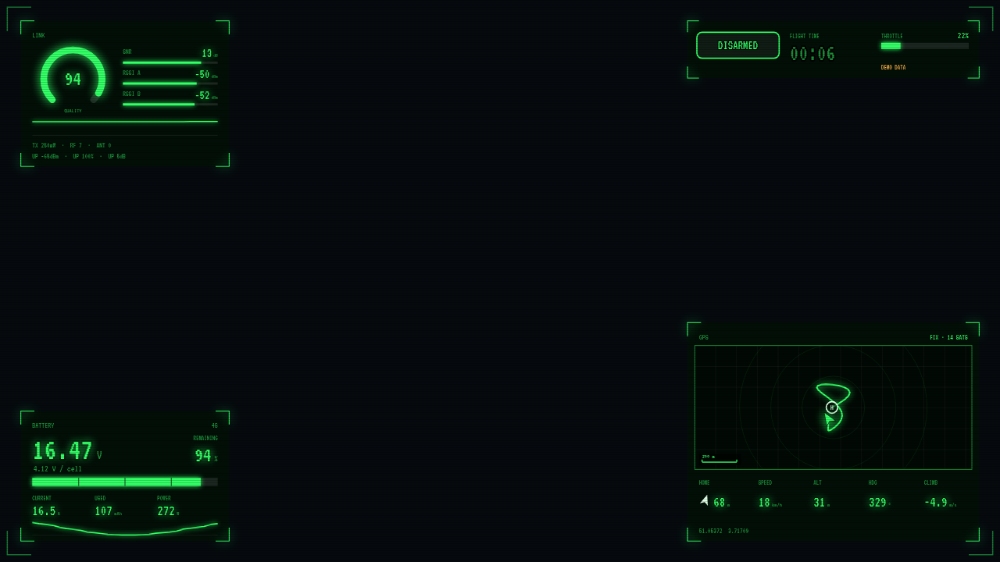
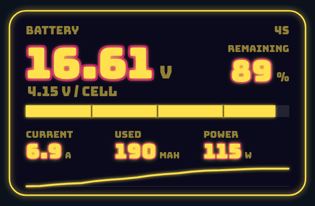
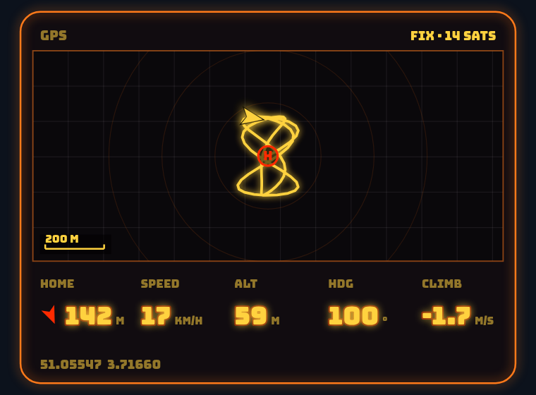
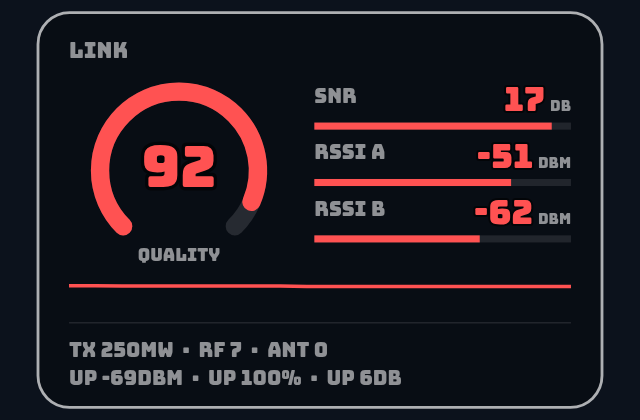

# Overlay guide

Sticklink has three pages. All work in a normal browser and in an OBS Browser Source.

## `/fx` - the effects overlay

The stickcam look, live: gimbal frames, glowing trails, sparks, shockwaves, a throttle bar and timers.

**Double-click the page** (OBS: right-click the source, *Interact*, double-click) to open the settings panel:

| Setting | Meaning |
|---|---|
| Style | Clean, Minimal, Neon, Arcade, Synthwave, Inferno, Unicorns & Rainbows, 80s Cyberpunk Hacker |
| Effects | Strength of the effects, 0 to 2 (sparks, shocks, shake) |
| Stick layout | Mode 1 to 4: which stick carries which axes (see below) |
| Video delay (ms) | Extra delay for the overlay, to line it up with a delayed video source |
| Size (px) | How big the gimbals are drawn (a reference size, default 1080); the panel shows the recommended Browser Source size for it |

Everything is saved by the server (`~/.config/sticklink/fx.json`) and applies to every open copy of the page within about
two seconds. Saved settings win over URL options; URL options (`?style=neon&chaos=1&mode=2&delay=0&size=1080`) only
fill in what has not been saved yet.

**Centering.** The overlay fills the whole page and keeps the gimbals in the middle of it, so it is centered in an OBS source of any
size or proportion, and it resizes with the source. If the source is too small for the chosen size, the gimbals are drawn smaller.

**What the effects react to.** Only what sticks and switches can drive: trails and sparks follow stick speed, a snap
(stick slammed to the edge) and a punch-out (throttle up fast) pop, full throttle and hang time get timers, arm/disarm
animates the frame, and a red CRASH FLIP badge shows while your crash-flip switch is on. Flips, rolls and crash detection
in stickcam need gyro and accelerometer data, which the radio does not send.

**Smooth trails, no lag.** The radio reports about 20 times a second but the overlay draws 60 frames a second. When a
new reading arrives, the frames since the previous one are redrawn as a smooth curve between the two real points
(a curve that never overshoots a real reading). Between readings the dot is projected a few tens of milliseconds ahead from
the recent motion. The newest reading is always shown exactly, so nothing is delayed.

### Stick layouts

| Mode | Left stick | Right stick |
|---|---|---|
| 1 | yaw + pitch | roll + throttle |
| 2 | yaw + throttle | roll + pitch |
| 3 | roll + pitch | yaw + throttle |
| 4 | roll + throttle | yaw + pitch |

Mode 2 is the common one: throttle on the left. The text labels of the Synthwave and Hacker styles are written for
modes 1 and 2 and can show the wrong axis names in modes 3 and 4.

## `/setup` - the receiver screen

- A live 3D quad (front props orange): right stick tilts it right, pitch up tilts the nose down, yaw spins it, throttle lifts it.
- Bars for the four mapped axes, ARM and CRASH FLIP lamps, and a monitor for all 16 channels.
- **Assign sticks / switches**: each function has a source drop-down, a *reverse* box and a **Learn** button.
  - Sticks: press Learn, then push that stick as the prompt says (roll right, pitch up, yaw right, throttle up). The page
    picks whichever input moved most and works out *reverse* from the direction.
  - Switches: put the switch in its **OFF** position, press Learn, flip it **ON**. The page remembers which channel
    moved, which way, and the threshold between the two positions. Crash Flip can be set to *none*.
  - Esc cancels. A banner warns if the radio is not sending channel data (the script on the radio is too old).
- **Stick layout** (modes above) sets how `/fx` arranges the gimbals.

Changes save automatically. The sources are the radio's inputs (`Stick: Ail/Ele/Rud/Thr`, and the two default command
channels) and its mixer outputs `CH1` to `CH16`. Defaults: sticks on their own inputs, ARM on radio channel 5, no Crash Flip.

## Telemetry HUD

`/hud` shows telemetry as badges in the same eight styles as `/fx`; `/hud/link`, `/hud/battery` and `/hud/gps` show one block each,
so they can be separate OBS Browser Sources. The pages fill whatever source size you give them and keep their content centred.

| Block | Shows | Needs these sensors (EdgeTX names) |
|---|---|---|
| **Link** | Quality dial and 30 s history, SNR, RSSI A/B, TX power, RF mode, antenna, uplink stats | `RQly RSNR 1RSS 2RSS TPWR RFMD ANT TRSS TQly TSNR` (ExpressLRS sends these) |
| **Battery** | Pack voltage, volts per cell, cell bar, current, mAh used, remaining %, power in W, voltage history | `RxBt Curr Capa Bat%` (from the flight controller; needs its battery telemetry enabled) |
| **GPS** | Map with live track, home marker, quad arrow, scale bar; distance and direction to home, speed, altitude, heading, climb, satellites | the radio script's GPS record, plus `Sats GSpd GAlt Alt Hdg VSpd` |
| **Status** | ARMED badge, flight timer, throttle, Crash Flip badge, radio state | your ARM / Crash Flip assignment from `/setup` |

Blocks without data say so ("NO LINK DATA", "WAITING FOR GPS...") instead of showing zeros. A sensor that stops updating turns grey with a dash.

**Warning colours.** Link quality: green from 80 %, amber from 60 %, red below. SNR: from 5 dB / 0 dB. RSSI: from -85 / -100 dBm. Battery
volts **per cell**: green from 3.5 V, amber from 3.3 V, red below, so set **Battery cells** to your pack (4S, 6S, ...). Remaining %:
from 30 % / 15 %. Satellites: from 8 / 5. Red values pulse.

**Double-click** any HUD page for its settings (saved on the server like `/fx`): style (or follow the main one), layout, which blocks appear,
battery cells, speed and altitude units, and the map. Layouts for the combined HUD: `corners` (one block in each corner, the middle stays free for
video), `row` (along the bottom) and `column` (down the left edge). The block pages ignore the layout.

**Flight timer.** It runs while your mapped ARM switch is on, restarts at each arming, and stays on screen after disarming. It lives in the browser
page, so refreshing the page (or the OBS source) resets it.

### The map

- **Provider**: OpenStreetMap standard tiles (default), CARTO dark or light, your own tile server (`custom URL`, with `{z}/{x}/{y}`, `https://` or `http://localhost`),
  or *no map*, which draws only the track on a grid. If tiles cannot be loaded, the block switches to the track-only view by itself ("MAP OFFLINE").
- **Zoom**: *auto* fits the whole track; a number is a fixed zoom, optionally following the quad. **Clear GPS track** forgets the track and home
  (also done by restarting the radio script). Home is the radio's own position if it has one, otherwise the first fix.
- **Credit**: the map always shows its provider's credit, as the providers require.
- **Terms and privacy**: tiles come straight from the provider to your browser, which tells the provider your IP address and the area you are viewing.
  Sticklink only requests tiles that are in view (no prefetching), a few at a time, and relies on your browser's HTTP cache, as the
  [OpenStreetMap tile policy](https://operations.osmfoundation.org/policies/tiles/) asks; OSM may still block heavy use. CARTO's free tiles are for
  non-commercial use only. For anything beyond light personal use, point the custom URL at your own tile service.
- Positions are only drawn if the radio script sends them; see [radio setup](radio-setup.md#telemetry-sensors-and-gps).

## Classic overlay

`/overlay` - a plain panel with two sticks, ARM/flip lamps and telemetry; 560 x 390.

| Option | Meaning | Example |
|---|---|---|
| `mode` | Stick mode 1-4 (default 2) | `?mode=2` |
| `invert` | Flip drawn axes | `?invert=pitch,yaw` |
| `delay` | Extra delay in ms, 0-5000 | `?delay=120` |
| `minimal` | Sticks only | `?minimal=1` |
| `telemetry` | `0` hides telemetry | `?telemetry=0` |
| `trail` | `0` hides the trail | `?trail=0` |
| `color` | Accent colour, six hex digits | `?color=ffaa66` |
| `sensors` | Which sensors, as `name:label:unit,...` (`V` shows two decimals) | `?sensors=RQly:LQ:%,RxBt:BAT:V` |
| `debug` | Show sequence, age and parser diagnostics | `?debug=1` |

Its ARM and FLIP lamps show the radio's default channels 5 and 8, not your `/setup` assignment. Trails are drawn as
smooth curves through the real readings.

## Timing and video delay

A capture card or camera usually delivers video later than the radio data. Raise **Video delay** (or `?delay=`) until a
sharp stick movement and the picture agree; record a clear movement and compare. This is manual: Sticklink does not
synchronise the radio and video clocks and cannot show the overlay *earlier* than the data (delay the video source in OBS
instead, if the overlay lags).

If no reading arrives for 500 ms the dots disappear and the overlay shows paused or disconnected states. These describe the
data from the radio to the computer, not the radio link to the drone.
