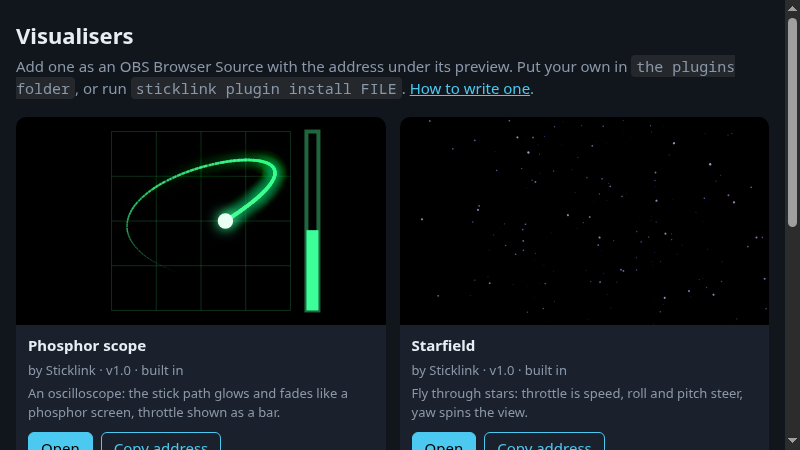

# Visualiser plugins

Write your own live visualisation, the way Winamp had visualisers: a small script draws on a canvas every frame and gets your sticks,
switches and telemetry as input. Sticklink shows it as a page you add to OBS as a Browser Source.



Three come with Sticklink (**Starfield**, **Neon tunnel**, **Phosphor scope**). Open `http://127.0.0.1:8765/viz` to see them all
running, and copy the address of the one you want into OBS (size 1920x1080 or whatever you like, the canvas fills the source and
the background is transparent).

## Install a plugin

| | |
|---|---|
| Window | **Add visualiser plugin...** and pick a `.zip` or `.js` file |
| Command line | `sticklink plugin install my-plugin.zip` (also a folder, or a single `.js`); `--force` replaces one with the same name |
| By hand | copy the folder into the plugins folder (`sticklink plugin path` prints it; `~/.config/sticklink/plugins`, on Windows `%USERPROFILE%\.config\sticklink\plugins`) |

New plugins appear at `/viz` without restarting. `sticklink plugin list` shows what is installed (and why a broken one cannot run),
`sticklink plugin remove NAME` removes one of yours. `--plugins-dir` on `run` and `plugin` uses another folder.

## Write one in two minutes

Make a folder `hello/` with two files.

`plugin.json`
```json
{ "name": "Hello", "author": "you", "version": "1.0", "description": "A dot that follows the right stick.", "api": 1 }
```

`main.js`
```js
Sticklink.visualizer({
  draw(ctx, w, h, f) {
    ctx.fillStyle = f.armed ? '#ff4d4d' : '#4cc9f0';
    ctx.beginPath();
    ctx.arc(w / 2 + f.sticks.roll * w / 3, h / 2 + f.sticks.pitch * h / 3, 20 + f.energy * 30, 0, Math.PI * 2);
    ctx.fill();
  },
});
```

Install it (`sticklink plugin install hello`) and open `/viz/hello`. For quick tries run `sticklink run --demo`: the demo moves the sticks for you.
Edit the file and reload the page (in OBS: right-click the source, *Refresh*).
A single `.js` file works too: `sticklink plugin install hello.js` makes the manifest for you.

### `plugin.json`

| Field | |
|---|---|
| `name` | required, up to 60 characters |
| `author`, `version`, `description` | optional text (description up to 200 characters) |
| `entry` | the script, default `main.js` |
| `api` | `1`. A plugin that needs a newer API than your Sticklink speaks is listed as not runnable |

The folder name is the id and the address: `/viz/<id>`. Files next to the script (images, fonts, JSON) may be used: `.js .json .png .jpg .jpeg .webp .gif .svg .woff .woff2 .ttf .txt`.
A plugin has at most 200 files and 10 MB.

### The script API

A plugin calls `Sticklink.visualizer({ ... })` once. All functions are optional except `draw`.

| Function | When |
|---|---|
| `init(ctx, w, h, info)` | once, before the first frame. `info.id` is the plugin id |
| `draw(ctx, w, h, f)` | every animation frame (about 60 per second). The canvas is cleared before each call, `ctx` is a normal 2D context, `w` and `h` are CSS pixels (high-DPI is handled for you) |
| `resize(ctx, w, h)` | when the source changes size |

`f`, the frame, holds everything you can draw from:

| | |
|---|---|
| `f.t`, `f.dt` | seconds since the start, seconds since the previous frame |
| `f.live` | `true` while the radio (or demo) delivers data. When `false` the sticks sit at rest |
| `f.status` | `live`, `demo`, `paused` or `disconnected` |
| `f.sticks` | `{roll, pitch, yaw, throttle}`, each -1..1, smoothed so the 20 Hz radio data looks fluid. Throttle is -1 (bottom) .. 1 (top) |
| `f.throttle` | throttle as 0..1 |
| `f.raw` | the same without smoothing (`null` when not live) |
| `f.energy` | 0..1, how busy the sticks are right now. Handy to make things pulse |
| `f.armed`, `f.crash` | the ARM and Crash Flip switches (as mapped on `/setup`): `true`, `false` or `null` when unknown |
| `f.channels` | all 16 channels as -1..1, or `null` (needs the current radio script) |
| `f.telemetry` | `{RQly: 98, RxBt: 15.9, ...}`; a sensor that is not currently received is `null` |
| `f.gps` | `{fix, lat, lon, home, distance_m, bearing_deg, ...}` as in `GET /api/v1/gps` |
| `f.trail(seconds)` | the last up to 10 seconds of smoothed sticks, oldest first: `[{age, roll, pitch, yaw, throttle}, ...]` |

`Sticklink.log(...)` writes to the browser console of the page (in OBS: right-click, *Interact*, F12), useful while developing.

If your script throws, the drawing stops and a red banner shows the message on the page, so you see it in OBS too.

Look at the three built-in plugins (`src/sticklink/web/plugins/` in the source) for complete examples.

## Safety: what a plugin can and cannot do

A plugin is code from someone else, running next to your stream. Sticklink runs it so that it stays a drawing:

- It runs in a **sandboxed frame** without the page's origin: it cannot read the Sticklink page, your settings, cookies or storage, and it cannot call the REST API.
- A **content security policy** blocks every network request from the plugin (no `fetch`, WebSocket, `XMLHttpRequest`, remote images or scripts) and forms.
  It can only load files from its own folder, and it only ever receives data that Sticklink hands it.
- Only a plain set of file types is installed; zips with `..` or absolute paths, links, scripts such as `.sh`, or too many or too large files are refused.
- It still **uses your CPU/GPU**: a badly written plugin can make OBS stutter. Remove it if so.

This is checked by an automated test (a probe plugin tries `fetch`, the parent page and storage in headless Chrome). Even so,
install plugins from people you trust, as you would any program, and read short scripts before using them. Plugins cannot change OBS or the radio.

## REST

`GET /api/v1/plugins` lists them (`id`, `name`, `author`, `description`, `version`, `builtin`, `error`, `url`). Pages: `/viz` (gallery), `/viz/<id>` (the visualiser).
