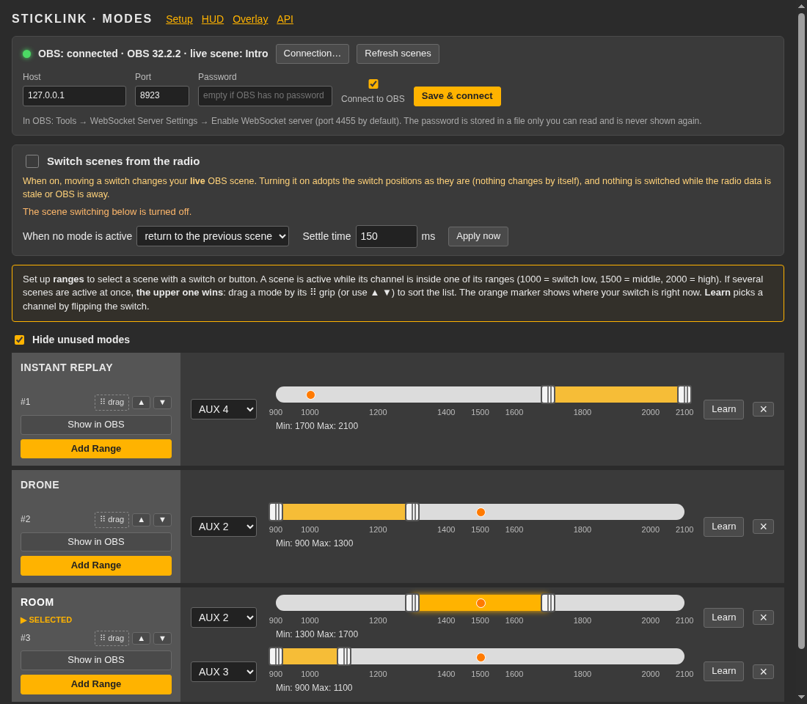

# Switching OBS scenes from the radio

`/modes` works like the **Modes** tab of Betaflight Configurator, but the modes are your **OBS scenes**: give a scene one or more **ranges** on a
radio channel, and Sticklink switches OBS to that scene while the channel is inside the range. Flip a 3-position switch to change camera, hold a
button for an instant replay, and let go to return.

## Set it up

1. **Turn on OBS's WebSocket server**: in OBS, *Tools, WebSocket Server Settings, Enable WebSocket server*. The default port is 4455. A password is
   optional; if you set one you will enter it below. (OBS 28 and newer have this built in.)
2. Open **`http://127.0.0.1:47613/modes`**, choose **Connection...**, check the host and port, tick **Connect to OBS** and press **Save & connect**.
   When it works, the line at the top turns green and shows OBS's version and the live scene, and **every OBS scene appears as a mode**.
3. For a scene, press **Add Range**, choose the **AUX** channel of your switch, and set the range with the two handles (drag them, click the bar,
   or use the arrow keys: left/right 25, PageUp/PageDown 100, Home/End). The **orange marker** is where your switch is right now.
4. Or press **Learn** on a range, and flip the switch to the position that should select the scene: Sticklink finds the channel and sets the matching
   third of the scale (low 900-1300, middle 1300-1700, high 1700-2100).
5. Tick **Switch scenes from the radio**. Changes save automatically.

`AUX 1` is radio channel 5, `AUX 2` is channel 6, and so on, as in Betaflight. Values are in microseconds: 1000 is a switch at its low end, 1500 the
middle, 2000 the high end. Channels come from the radio script's channel report ([radio setup](radio-setup.md)).

## Sorting: when two conditions are met, the upper scene wins

Several scenes can be active at once (for example the room camera on a 3-position switch, and a replay on a button). Sticklink then picks the **upper one
in the list**. The first column shows each mode's priority (`#1` is the top). **Sort them by dragging a card by its grip (the `⠿ drag` box) or with the
▲ ▼ buttons.** A card that is active is outlined; the one that wins is labelled **SELECTED**, and the others that are also active say so. When the
winner's condition ends, the next active scene below it takes over.

## What happens when no scene is active

Choose under **When no mode is active**:

- **stay on the current scene** (default): nothing changes.
- **return to the previous scene**: go back to the scene OBS showed before the first mode took over. This is the one for a held button.
- **go to...** a fixed scene of your choice.

## Settle time and safety

Switching scenes changes your **live output**, so it is built to be careful:

- **Off until you turn it on**, and when you turn it on (or when OBS reconnects) Sticklink *adopts* the switch positions as they are. Nothing
  changes by itself; the next movement of a switch does. **Apply now** switches to what the switches ask for right now, when you want that.
- **Settle time** (default 150 ms): a scene must stay requested this long before OBS is switched, so a 3-position switch passing through its middle
  position does not flash the middle scene.
- **Nothing is switched while the radio data is stale or OBS is away**, and nothing is retried in a loop: a failed switch (for example a scene that
  was renamed) is recorded once. The page shows the reason when the engine is waiting, and the last switch.
- A scene that is in your modes but no longer in OBS is flagged **not in OBS**.
- Sticklink only ever sets the **program scene**. It does not touch sources, recording or streaming.

## Examples

| Goal | Setup |
|---|---|
| Three cameras on a 3-position switch (AUX 2) | `Drone`: AUX 2 900-1300, `Room`: AUX 2 1300-1700, `Replay`: AUX 2 1700-2100 (or press Learn on each) |
| Instant replay while a button is held | `Instant replay`: AUX 4 1700-2100, sorted to the top; **When no mode is active: return to the previous scene** |
| Crash camera when the flip-over switch is on | `Crash view`: the crash-flip channel 1700-2100, sorted above the others so it wins |
| One scene for two different switches | give the scene two ranges, one per channel |

## The OBS connection and its password

The OBS password (if any) is saved together with the modes in `~/.config/sticklink/scenes.json` (`--scenes-config` to change it), in a file only your
user can read on Linux and macOS. It is never shown again by Sticklink or its API; leave the password box empty to keep it. obs-websocket does not send the
password over the network (it answers a challenge), but its connection is not encrypted, so connect to an OBS on another computer only over a network you trust.

## API

`GET /api/v1/obs` (connection, scenes, current scene), `PATCH /api/v1/obs/connection`, `POST /api/v1/obs/scene` (switch now),
`GET`/`PUT /api/v1/scene-modes`, `GET /api/v1/scene-modes/state` (live values, active scenes, recent switches), `POST /api/v1/scene-modes/apply`.
See `/docs` ([REST API](api.md)). Every POST needs `Content-Type: application/json`.
