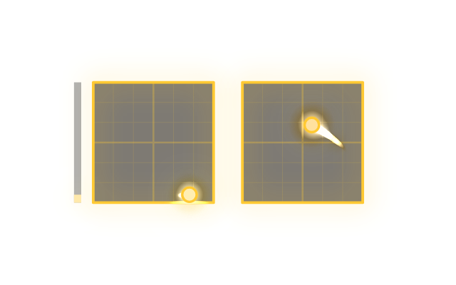

# Themes

The stick overlay (`/fx`) and the telemetry HUD (`/hud`) come with eight looks (Clean, Minimal, Neon, Arcade, Synthwave, Inferno,
Unicorn, Hacker). A **theme** adds one more: your colours, your frame shape, glow, trails, popup texts, even your own font. Share it as
one small file, and anyone can drop it in.



Two example themes ship with Sticklink: **Gold Rush** and **Blueprint**. They are in the style list like any other.

## Use a theme

Double-click the overlay (in OBS: right-click the source, *Interact*, then double-click), open **Style** and pick it. The HUD has its own style
setting and offers the same list.

## Install a theme

| | |
|---|---|
| Window | **Add theme...** and pick a `.json` or `.zip` file |
| Command line | `sticklink theme install gold.json` (also a folder or a `.zip`); `--force` replaces one with the same name |
| By hand | copy the file or folder into the themes folder: `sticklink theme path` prints it (`~/.config/sticklink/themes`; Windows: `%USERPROFILE%\.config\sticklink\themes`) |

New themes show up without a restart (reload the overlay page, or in OBS right-click the source, *Refresh*).
`sticklink theme list` shows what is installed and why a broken one cannot be used; `sticklink theme remove NAME` removes one of yours.
If you remove the theme an overlay was using, that overlay falls back to a built-in look.

## Make one in two minutes

Save this as `my-look.json` (the file name is the theme's id):

```json
{
  "name": "My Look",
  "author": "you",
  "description": "Hot pink on dark glass.",
  "api": 1,
  "base": "neon",
  "style": {
    "ring": "#ff2e93",
    "dot": "#ffffff",
    "hot": "#ffe14d",
    "plate": "rgba(20,0,15,0.5)",
    "glow": 0.5,
    "trail": 0.6
  }
}
```

Then `sticklink theme install my-look.json` and pick **My Look**. Everything you do not mention comes from the `base` style (any of the eight
built-in ones; default `clean`), so a theme can be tiny. Edit, re-install with `--force`, reload.

### `theme.json` fields

| Field | |
|---|---|
| `name` | required, up to 40 characters |
| `author`, `version`, `description` | optional plain text (description up to 120 characters; it is shown under the style list) |
| `api` | `1` (optional; a theme for a newer format is listed as unusable) |
| `base` | the built-in style to start from: `clean`, `minimal`, `neon`, `arcade`, `synthwave`, `inferno`, `unicorn`, `hacker` |
| `style` | the settings you change (below) |
| `fonts` | optional: `[{"family": "My Font", "file": "myfont.woff2"}]`. Needs the folder or zip form, with the font next to `theme.json`. Use the family in `style.font` |

### `style` settings

Colours are `#rgb`, `#rrggbb`, `rgb()/rgba()/hsl()/hsla()` or a plain colour name. A mistyped name or a value out of range makes the theme unusable and
`sticklink theme list` says which one, so mistakes do not pass silently.

| Setting | Meaning |
|---|---|
| `frame` | `circle`, `square`, `brackets`, `none` |
| `plate` | background of each gimbal (colour or `null`) |
| `ring`, `ringW` | outline colour (or `"rainbow"`) and its thickness (0.005-0.3, in gimbal radii) |
| `cross`, `grid` | crosshair colour (or `null`) and grid lines per half axis (0-12) |
| `dot`, `dotR`, `dotRing`, `dotShape` | stick dot colour, size (0.02-0.5), outline colour (or `null`), `circle` or `square` |
| `hot` | colour the dot and trail turn at high stick speed (or `null`) |
| `glow`, `bloom` | glow around rings and dots (0-2) and a soft bloom of the effects (0-1.5) |
| `trail`, `trailW` | trail length in seconds (0-3, `0` = none) and width |
| `sparks`, `sparkColors`, `sparkShape` | spark amount (0-3), 1-8 colours, `streak`, `star` or `glyph` |
| `shock`, `shake`, `flame`, `embers`, `glitch` | shockwaves, screen shake, throttle afterburner, rising embers, glitch bands |
| `scan`, `chroma` | scanlines (0-1) and RGB split (0-0.2) |
| `popups`, `stats`, `thrBar`, `labels`, `intro`, `rainbow`, `readout` | `true` / `false`: popup texts, live timers, throttle bar, stick labels, arm/disarm animation, hue-cycling, numeric readout |
| `popupStyle` | `pop` (bouncy) or `terminal` (typed lines) |
| `font`, `textColor`, `textStroke` | popup font as CSS with `{px}` for the size, e.g. `"bold {px}px 'My Font', sans-serif"`, and text colours |
| `labelMap` | rename popup texts: `{"WASTED": "OOPS", "ARMED": "GO"}` |

The two example themes are complete real examples: `src/sticklink/web/themes/` in the source.

### Share a theme

A single `.json` file (no fonts) or a `.zip` (with `theme.json` at the top or inside one folder, plus font files). Only `theme.json` and `.woff2`, `.woff`, `.ttf` files are accepted;
at most 20 files and 5 MB.

## Safety

A theme is **data only**: nothing in it is ever run as code. Colours, numbers and texts are checked against the list above when installed and again when read; zips with
`..` or absolute paths, links, scripts or other file types are refused. A theme cannot reach the network, your settings or OBS. The worst a theme can do is look bad.
(Fonts are font files the browser loads from the theme's folder; as with any font you download, install them from sources you trust.)

## REST

`GET /api/v1/themes` lists them (with the settings they change and any error); `GET /api/v1/styles` lists every style you can choose, built-in and themes.
Choose one with `PATCH /api/v1/settings {"style": "my-look"}`.
